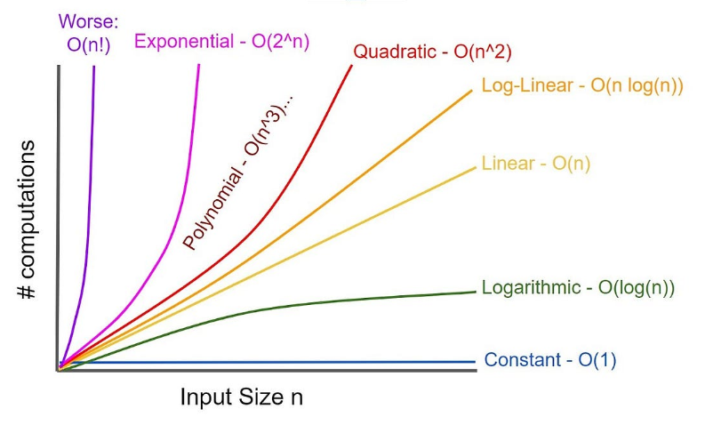
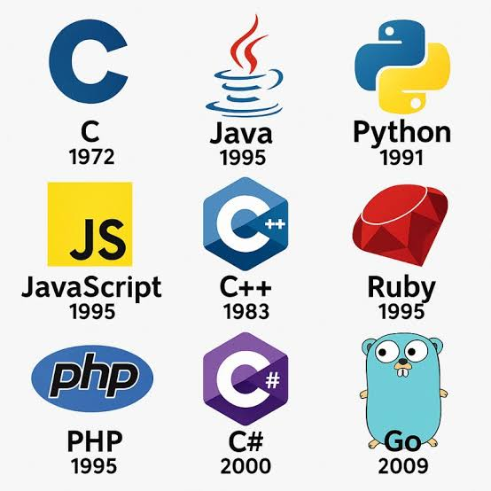

<h3 class="blog-subtitle">
هنا التدوينات كاملة
</h3>

1. [مقدمة عن هياكل البيانات](blog/ds1.qmd)

 

هياكل البيانات هي طرق تنظيم وتخزين البيانات في الحاسوب بحيث يمكن الوصول إليها لإدارتها بشكل جيد , بدون الحاجة لقاعدة بيانات خارجية وما إلى ذلك. في هذا المقال سنستعرض بعض هياكل البيانات الأساسية التي يستخدمها المبرمجون في مشاريعهم.

 

[أكمل القراءة](blog/ds1.qmd)

2. [التحليل المقارب](blog/asymptotic.qmd)

 

هو نوع من أنواع التحليل الرياضي لمعرفة مدى استمرارية الخوارزميات ووقتها لتقييم سلوكها .

 

[أكمل القراءة](blog/ds1.qmd)

3. [أنواع لغات البرمجة](blog/languages.qmd)

 

هو نوع من أنواع التحليل الرياضي لمعرفة مدى استمرارية الخوارزميات ووقتها لتقييم سلوكها .

 

[أكمل القراءة](blog/ds1.qmd)

4. [دالة التنسيق الموزعة](blog/dcf.qmd)

 

يرجى قبل قراءة هذا المقال مراجعة مقال شبكات الحاسب في مدونتي للذكاء الاصطناعي

 

[أكمل القراءة](blog/dcf.qmd)

