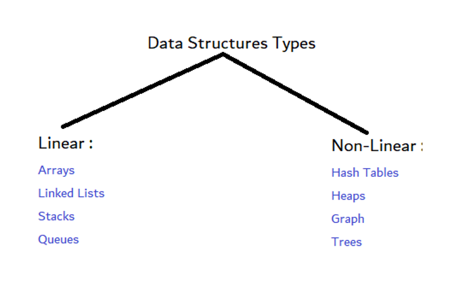

<h3 class="blog-subtitle">
هنا التدوينات كاملة
</h3>

1. [مقدمة عن هياكل البيانات](blog/ds1.qmd)

 

هياكل البيانات هي طرق تنظيم وتخزين البيانات في الحاسوب بحيث يمكن الوصول إليها لإدارتها بشكل جيد , بدون الحاجة لقاعدة بيانات خارجية وما إلى ذلك. في هذا المقال سنستعرض بعض هياكل البيانات الأساسية التي يستخدمها المبرمجون في مشاريعهم.

 

[أكمل القراءة](blog/ds1.qmd)

