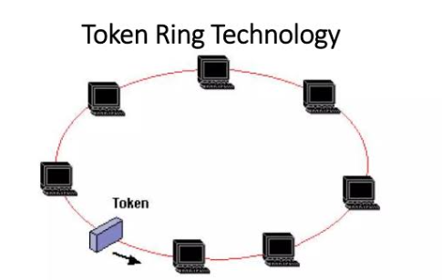
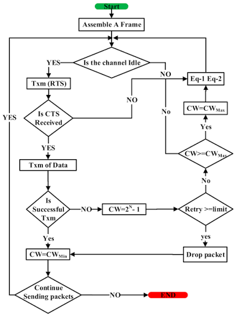

## مقدمة

يرجى قبل قراءة هذا المقال مراجعة مقال شبكات الحاسب في مدونتي للذكاء الاصطناعي

[من هنا](https://saadaiblog.netlify.app/blog/post35.5)

وستتعرف على نماذج الشبكات الأشهر وهما :

- OSI

- TCP/IP

وعلى الطبقة الشهيرة طبقة ربط البيانات أو :

`Data Link Layer`

 وهي الطبقة المسؤولة عن ربط الاتصال بين شبكتين في كلا النموذجين , ومع ذلك فإنه هناك إختلافات طفيفة في بعض جوانب الشبكات السلكية أو اللاسلكية في بعض الطبقات وبعض الأجهزة المسؤولة .

### IEEE
أو معهد مهندسي الكهرباء والإلكترونيات وهي أكبر منظمة هندسية وتقنية غير ربحية في العالم , توسعت حتى شملت مجالات أخرى غير الكهرباء والإلكترونيات في الآونة الأخيرة مثل البرمجة وحتى الفيزياء والكيمياء والعلوم الطبيعية .

وضعت الشركة معياراً للشبكات المحلية أو ماتعرف بالـ :

`LANs - Local Area Networks`

والمعيار هو :

`IEEE 802`

اندرج تحته معايير فرعية مثل :

- `IEEE 802.2` : وهو لطبقة ربط البيانات المنطقية , وهي طبقة فرعية داخل طبقة ربط البيانات وهي الطبقة الثانية من الأسفل في نموذج أو إس آي ومدمجة مع الطبقة الأولى من الأسفل في نموذج التي سي بي آي بي .

- `IEEE 802.3` : خاصة بالشبكات المحلية السلكية أو المعروفة بالإيثرنت

- `IEEE 802.5` : خاصة بالشبكات المحلية التي تستخدم حلقة رمزية تنتقل من جهاز لآخر وغالباً تكون طوبولوجيا الشبكة عبارة عن شبكة حلقية أي حواسيب على شكل حلقات مرتبطة ببعضها البعض

- `IEEE 802.11` : وهو معيار الشبكات المحلية اللاسلكية التي تستخدم التقنية الشهيرة المعروفة بالواي فاي أو الوايرلس فيدالتي

الواي فاي هي إختصاراً لوايرلس فيدالتي وهي اسم تسويقي يُدل كترجمة على **الولاء للاسلكية** أو ماشابه .

وهي أهم معيار لدينا اليوم لأنه هذا المعيار يستخدم خوارزميتين شهيرتين وواحدة منها سنتكلم عنها اليوم وهي دالة التنسيق الموزعة .

والأخرى هي دالة التنسيق النقطية أو :

`PCF - Point Coordination Function`

### الخوارزمية

إذا كان وسط النقل خالياً فيتم الإرسال

أما إذا كان وسط النقل غير خالي فسيتم إتباع الخطط الآتية :

1. المُرسل يتحسس وسط النقل حتى يصبح الوسط خالياً من الإرسالات

2. مجرد أن يصبح الوسط شاغراً، يؤجل المرسل نشاطه لفترة زمنية تساوي الفاصل الزمني بين الإطارات أو

`IFS`

، ثم يستشعر الوسط مرة أخرى.

3. إذا ظل الوسط شاغراً، يتراجع المرسل (ينتظر) لفترة زمنية أُسية، ثم يستشعر الوسط مجدداً بعد انقضاء هذه الفترة

4. إذا بقي الوسط شاغراً بعد هذا كله سيقوم المُرسل بالإرسال بشكل فوري

## مصادر ومراجع

- [Wikipedia - DCF](https://en.wikipedia.org/wiki/Distributed_coordination_function)
- [Tutorialspoint - Distributed Coordination Function](https://www.tutorialspoint.com/article/distributed-coordination-function-dcf)
- [Science Direct - DCF](https://www.sciencedirect.com/topics/computer-science/distributed-coordination-function)