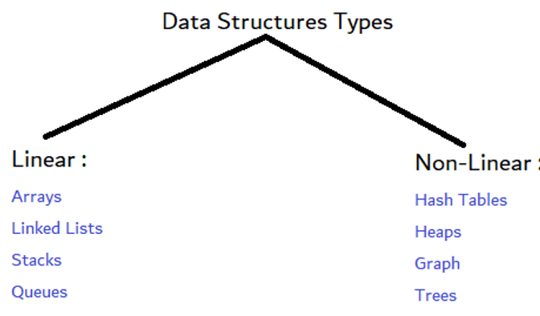

## مقدمة
هياكل البيانات هي طرق تنظيم وتخزين البيانات في الحاسوب بحيث يمكن الوصول إليها لإدارتها بشكل جيد , بدون الحاجة لقاعدة بيانات خارجية وما إلى ذلك. في هذا المقال سنستعرض بعض هياكل البيانات الأساسية التي يستخدمها المبرمجون في مشاريعهم.

### أنواع هياكل البيانات

1. هياكل بيانات خطية (Linear Data Structures):
هياكل بيانات خطية هي تلك التي يتم فيها تخزين البيانات في تسلسل خطي. من أمثلة هياكل البيانات الخطية:

- **المصفوفات**: هي مجموعة من العناصر المتشابهة في

- **القوائم المرتبطة**: هي مجموعة من العقد التي تحتوي كل عقدة على بيانات وإشارة إلى العقدة التالية.

- **المكدسات**: هي هياكل بيانات تتبع مبدأ "الأخير في الأول" (LIFO).

- **الطوابير**: هي هياكل بيانات تتبع مبدأ "الأول في الأول" (FIFO).

1. هياكل بيانات غير خطية (Non-Linear Data Structures):
هياكل بيانات غير خطية هي تلك التي لا يتم فيها تخزين البيانات في تسلسل خطي. من أمثلة هياكل البيانات غير الخطية:

- **الأشجار**: هي هياكل بيانات تتكون من عقد مرتبطة ببعضها البعض في شكل شجري.

- **الرسوم البيانية**: هي هياكل بيانات تتكون من عقد مرتبطة ببعضها البعض في شكل غير خطي.

- **الجداول**: هي هياكل بيانات تستخدم لتخزين البيانات في شكل أزواج مفتاح-قيمة.

- **الكُتل**: هي هياكل بيانات تستخدم لتنظيم البيانات في شكل شجري بحيث يكون لكل عقدة قيمة أكبر أو أصغر من قيم العقد الأخرى.

### المهام المطبقة بهياكل البيانات
- الحذف
  
- الإدراج
  
- البحث
  
- الترتيب

- التنقل

### الخاتمة
هياكل البيانات هي الجزء المتقدم من عالم البرمجة , والذي ينبغي عليك تعلمه بعد أساسيات البرمجة ولغات البرمجة وأنماط البرمجة مثل البرمجة الشيئية والوظيفية, وتعد من أهم المواضيع في علوم وهندسة الحاسوب حيث تساعدك على كتابة برامج ذات كفاءة عالية.