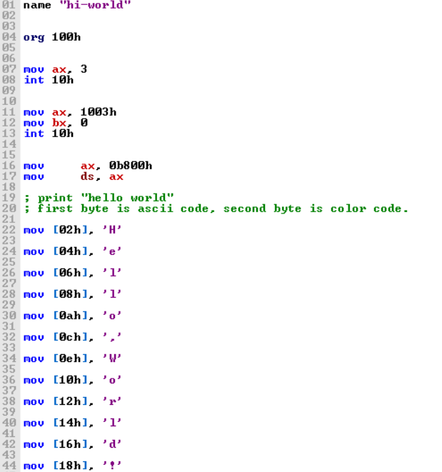

## لغة البرمجة
لغة البرمجة هي لغة تستخدم لكتابة الأوامر الموجهة والمطلوب من الحاسوب تنفيذها , نستخدم في حياتنا التقنية العديد من لغات البرمجة لعدد من الإستخدامات .

هناك العديد من لغات البرمجة وبالطبع من أنواع مختلفة عن بعضها البعض ولكن قبل ذلك يجب أن نعرف خلفية مسبقة عن الموضوع

### خلفية عن لغات البرمجة

الحاسوب لا يفهم بشكل رئيسي غير لغة الآلة أو لغة الصفر والواحد , كان أول لغة برمجة معروفة هي لغة التجميع أو المعروفة بالأسيمبلي وهي لغة برمجة منخفضة المستوى تتعامل مع معالج الحاسوب بشكل مباشر , وبالأصح كانت الأسيمبلي تعبيراً بشرياً عن لغة الآلة وكان فيها إشكالية أن طريقة كتابة لغة التجميع مختلفة حول بُنية بناء المعالج نفسه.



لاحقاً تم إنشاء لغات برمجة مثل لغة السي والتي تعد لغة أم لأغلب لغات البرمجة في العصر الحالي مثل سي بلس بلس وجافا وبايثون ورست .


### أنواع لغات البرمجة الرئيسية

1.البرمجة الإجرائية :

وهي أشهر نوع من أنواع البرمجة وتعد لغات مثل جافا وبايثون وسي معتمدة على أسلوب البرمجة الإجرائية , حيث تعتمد على سلسلة من الاجراءات ويتم تنفيذ الملف كاملاً من بدايته لنهايته وتتكون من متغيرات وقيم مُسندة إليها وتسمى كل متسلسلة من الخطوات إجراءات .

```c

#include <stdio.h>


int addNumbers(int a, int b) {
    return a + b;
}

int main() {
    int num1 = 5;
    int num2 = 10;
    int sum = 0;


    sum = addNumbers(num1, num2);


    printf("The sum is: %d\n", sum);
    return 0;
}


```

لغات برمجة إجرائية :

- جافا
- سي
- سي بلس بلس
- بايثون
- باسكال
- بيسك


2. البرمجة الوظيفية :
يركز هذا النوع على التقييمات والمخرجات الرياضية أكثر من كتابة التعليمات البرمجية , 

```js

const numbers =;


const isEven = x => x % 2 === 0;
const double = x => x * 2;

const result = numbers.filter(isEven).map(double);

console.log(result); // [4, 8]
console.log(numbers); // [1, 2, 3, 4, 5] 


```

ونلاحظ هنا أنها لغات تعتمد على الدوال بشكل رئيسي أكثر من المتسلسلات البرمجية , وفي الوقت الحالي هناك أكثر من لغة تدعم هذا الأسلوب رغم كونها تنتمي لأسلوب آخر مثل :

- بايثون
- جافا سكريبت

ولغات وظيفية بالكامل :

- هاسكل
- سكالا
- إف شارب

3. البرمجة الكائنية أو الشيئية :
وهي أسلوب برمجة يعتمد على إنشاء الكائنات بدلاً من الأسلوب الإجرائي القديم , أسلوب تم ابتكاره في الستينات وطورته لغة سي بلس بلس بشكل كبير والتي كانت تحسين واضح للغة سي , أشتهر بهذا الأسلوب لاحقاً لغة جافا

وتعد اللغات التي تدعم هذا النوع كثيرة من ضمنها :

- جافا
- بايثون
- سي بلس بلس
- سي شارب
- جافا سكريبت
- بي اتش بي
- روبي

كود جافا ينشئ مركبات :

```java

// Class for Vehicle with properties wheels and type
public class Vehicle {
    private int wheels;
    private String type;
    

    // Constructor
    public Vehicle (int wheels , String type) {
        this.wheels = wheels;
        this.type = type;

    }

    // Getters and Setters
    // for wheels and type
    public int getWheels() {
        return wheels;
    }

    public void setWheels(int wheels) {
        this.wheels = wheels;
    }

    public String getType () {
        return type;
    }

    public void setType(String type) {
        this.type = type;
    }

@Override
public String toString() {
    return "Vehicle [Wheels=" + wheels + ", Type=" + type + "]";
}

}

```

[مشروع برمجة شيئية كامل](https://github.com/Saad711T/CarsjavaOOP)

4. البرمجة المنطقية :
لغة برمجة تعتمد على المنطق والقواعد والقوانين أكثر من التعليمات البرمجية , وتستخدم كثيراً في البرمجيات التي تحتاج تركيز بشكل أكبر حول المنطق مثل الذكاء الاصطناعي رغم قدم بعض هذه اللغات وعدم إستخدامها في اليوم الحالي .

أبرز هذه اللغات :

- برولوج
- ليسب
- داتا لوج

وهذا مثال كود لبرولوج التي تعد من لغات البرمجة المنطقية :

```prolog

can(bird, fly).
have(bird, wings).
is_a(parrot, bird).
color(parrot, green).

have(X,Y) :-
    is_a(X,Z),

    have(Z,Y).

can(X, Y) :-
    is_a(X, Z),
    
    can(Z, Y).


```


ويعد هذا النوع شبيه جداً بالبرمجة الكائنية كونه يعتمد على العلاقات المنطقية بين كائنات معينة .

5. برمجة سكريبت :
لغات تستخدم في الأتمتة وإدارة الويب الديناميكية وأشهر اللغات من هذا النوع هي :

- بي اتش بي
- جافا سكريبت

6. برمجة ترميزية :
هي ليست لغات برمجة في الواقع كونها لا تحتوي على عناصر لغات البرمجة مثل المتغيرات والحلقات وغيرها , ولكن تعد لغات نصية ترميزية شبيهة بلغات البرمجة و لايعرفها غالباً غير المطورين والمبرمجين خصوصاً مطورين الويب

وأشهر اللغات من هذا النوع :

- اتش تي ام ال
- سي اس اس
- ماركداون : والتي أستخدمها الآن لكتابة هذه التدوينة

وهناك الكثير من الأنواع الأخرى مثل البرمجة العلمية ولغاتها مثل ماتلاب وآر والتي سنتطرق لها في وقت لاحق إن شاء الله...

## مصادر ومراجع

- [Coursera - 5 Types of Programming Languages](https://www.coursera.org/articles/types-programming-language)
- [Princeton University - Algorithms book](https://algs4.cs.princeton.edu/home/)
- [University of Michigan - Python for Everybody Specialization on Coursera](https://www.coursera.org/specializations/python)